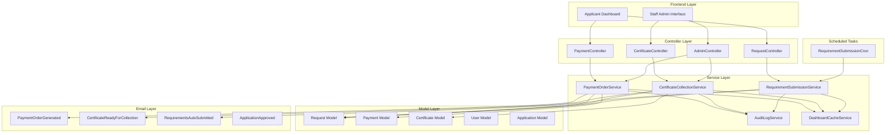
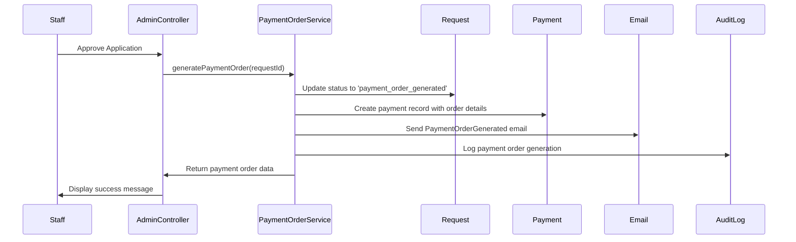
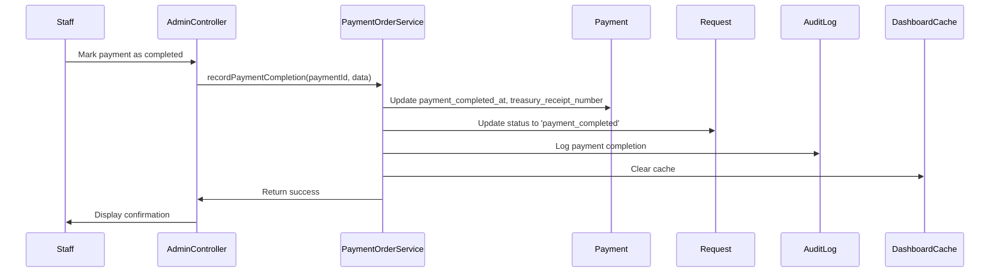
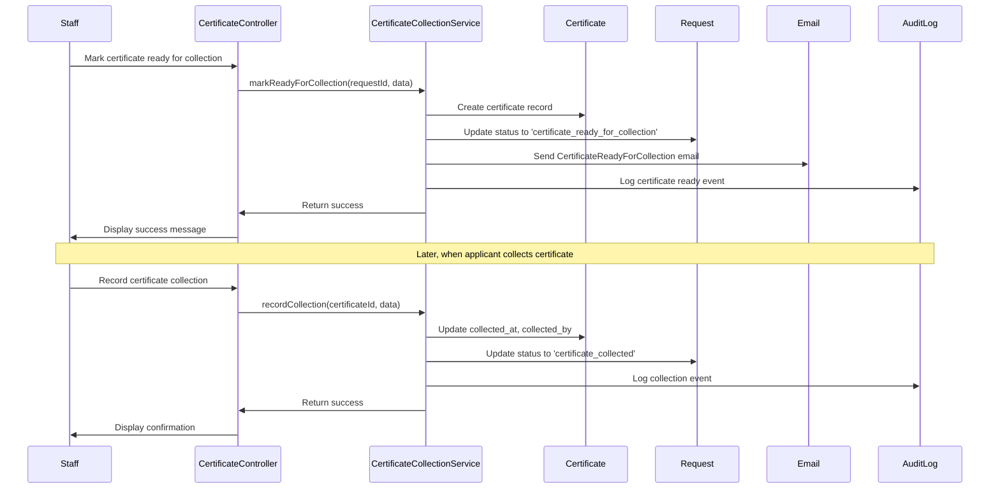
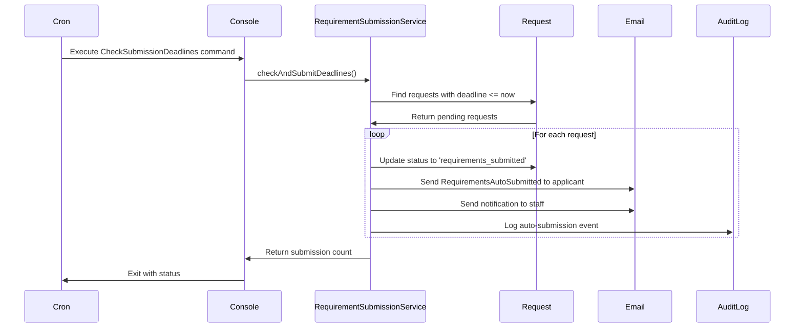
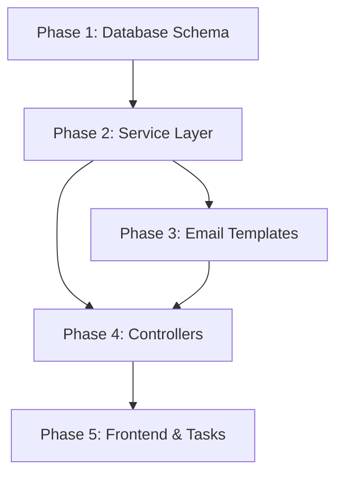

# Design Document: Payment Certificate Workflow Revision

## Overview

This design document specifies the technical architecture for transitioning the land certification application management system from digital/online workflows to physical/offline processes. The system will replace online payment receipt submission with treasury-based payment orders, remove automatic PDF certificate generation in favor of physical certificate collection tracking, and add automated requirement submission at configured deadlines.

### Current State

The existing system supports:
- Online payment receipt upload by applicants
- Admin verification/rejection of payment receipts
- Automatic PDF certificate generation upon payment approval
- Digital certificate download by applicants
- Payment reminder emails

### Target State

The revised system will support:
- Payment order generation for treasury-based cash payments
- Staff manual recording of treasury payment completion (no upload/approval workflow)
- Physical certificate collection tracking at CPDO office
- Automated requirement submission at configured deadlines
- Updated workflow statuses reflecting physical processes
- Preservation of historical data from deprecated workflows

### Key Design Principles

1. **Data Preservation**: All historical payment and certificate data must be retained
2. **Workflow Simplification**: Remove complex approval workflows in favor of simple status recording
3. **Physical Process Support**: Design for offline, in-person interactions
4. **Audit Trail**: Maintain comprehensive logging of all workflow transitions
5. **Backward Compatibility**: Ensure historical records remain accessible in read-only mode

## Architecture

### System Component Diagram



### Data Flow Diagrams

#### Payment Order Generation Flow



#### Payment Completion Recording Flow




#### Certificate Collection Flow



#### Automated Requirement Submission Flow



## Components and Interfaces

### Service Layer Components

#### PaymentOrderService

Handles payment order generation and treasury payment completion recording.

```php
namespace App\Services;

class PaymentOrderService
{
    /**
     * Generate a payment order for an approved application
     * 
     * @param int $requestId The request ID
     * @return array Payment order data including order number, amount, and PDF path
     * @throws \Exception if request is not in approved status
     */
    public function generatePaymentOrder(int $requestId): array;
    
    /**
     * Record that payment was completed at the treasury
     * 
     * @param int $paymentId The payment ID
     * @param array $data Contains treasury_receipt_number, completed_by_staff_id
     * @return Payment The updated payment model
     * @throws \Exception if payment is already completed
     */
    public function recordPaymentCompletion(int $paymentId, array $data): Payment;
    
    /**
     * Generate a unique payment order reference number
     * 
     * @return string Format: PO-YYYY-NNNNN
     */
    private function generateOrderNumber(): string;
    
    /**
     * Calculate payment amount based on application details
     * 
     * @param Request $request
     * @return float Payment amount
     */
    private function calculatePaymentAmount(Request $request): float;
    
    /**
     * Generate payment order PDF document
     * 
     * @param array $orderData
     * @return string Path to generated PDF
     */
    private function generatePaymentOrderPdf(array $orderData): string;
}
```

#### CertificateCollectionService

Manages physical certificate collection workflow.

```php
namespace App\Services;

class CertificateCollectionService
{
    /**
     * Mark a certificate as ready for collection after manual signatures
     * 
     * @param int $requestId The request ID
     * @param array $data Contains physical_certificate_number, marked_ready_by_staff_id
     * @return Certificate The created certificate model
     * @throws \Exception if payment is not completed
     */
    public function markReadyForCollection(int $requestId, array $data): Certificate;
    
    /**
     * Record that an applicant collected their certificate in person
     * 
     * @param int $certificateId The certificate ID
     * @param array $data Contains collected_by_staff_id, collection_notes
     * @return Certificate The updated certificate model
     * @throws \Exception if certificate is not ready for collection
     */
    public function recordCollection(int $certificateId, array $data): Certificate;
    
    /**
     * Get collection statistics for dashboard
     * 
     * @return array Statistics about certificates ready and collected
     */
    public function getCollectionStats(): array;
}
```

#### RequirementSubmissionService

Handles automated requirement submission at configured deadlines.

```php
namespace App\Services;

class RequirementSubmissionService
{
    /**
     * Set or update the submission deadline for a request
     * 
     * @param int $requestId The request ID
     * @param \DateTime $deadline The submission deadline
     * @param int $staffId The staff member setting the deadline
     * @return Request The updated request model
     * @throws \Exception if deadline is in the past
     */
    public function setSubmissionDeadline(int $requestId, \DateTime $deadline, int $staffId): Request;
    
    /**
     * Check for deadlines and automatically submit requirements
     * Called by scheduled task
     * 
     * @return int Number of requests auto-submitted
     */
    public function checkAndSubmitDeadlines(): int;
    
    /**
     * Manually trigger submission for a specific request
     * 
     * @param int $requestId The request ID
     * @param int $staffId The staff member triggering submission
     * @return Request The updated request model
     */
    public function manuallySubmitRequirements(int $requestId, int $staffId): Request;
    
    /**
     * Get requests with upcoming deadlines
     * 
     * @param int $daysAhead Number of days to look ahead
     * @return \Illuminate\Support\Collection Collection of requests
     */
    public function getUpcomingDeadlines(int $daysAhead = 7): \Illuminate\Support\Collection;
}
```

### Controller Endpoints

#### PaymentController (Modified)

```php
// Remove deprecated endpoints:
// - POST /payments (store payment receipt)
// - GET /payments/{id}/download (download receipt)

// Keep existing endpoint:
// GET /payments - Display payment page for applicant (modified to show payment orders)

// Add new endpoint:
// GET /payment-orders/{id}/download - Download payment order PDF
public function downloadPaymentOrder(int $paymentId): \Symfony\Component\HttpFoundation\BinaryFileResponse;
```

#### CertificateController (New)

```php
namespace App\Http\Controllers;

class CertificateController extends Controller
{
    /**
     * Display certificate management interface for staff
     * GET /admin/certificates
     */
    public function index(): \Inertia\Response;
    
    /**
     * Mark certificate as ready for collection
     * POST /admin/certificates/ready
     * 
     * Request body:
     * {
     *   "request_id": 123,
     *   "physical_certificate_number": "CERT-2025-00001"
     * }
     */
    public function markReady(Request $request): \Illuminate\Http\RedirectResponse;
    
    /**
     * Record certificate collection
     * POST /admin/certificates/{id}/collect
     * 
     * Request body:
     * {
     *   "collection_notes": "Collected by applicant with valid ID"
     * }
     */
    public function recordCollection(int $certificateId, Request $request): \Illuminate\Http\RedirectResponse;
    
    /**
     * Get certificate collection statistics
     * GET /admin/certificates/stats
     */
    public function stats(): \Illuminate\Http\JsonResponse;
}
```

#### AdminController (Modified)

```php
// Add new endpoints for payment management:

/**
 * Display payment management interface
 * GET /admin/payments
 */
public function payments(): \Inertia\Response;

/**
 * Record treasury payment completion
 * POST /admin/payments/{id}/complete
 * 
 * Request body:
 * {
 *   "treasury_receipt_number": "TR-2025-12345"
 * }
 */
public function completePayment(int $paymentId, Request $request): \Illuminate\Http\RedirectResponse;
```

#### RequestController (Modified)

```php
// Add new endpoints for deadline management:

/**
 * Set submission deadline for a request
 * POST /admin/requests/{id}/deadline
 * 
 * Request body:
 * {
 *   "submission_deadline": "2025-03-15 17:00:00"
 * }
 */
public function setDeadline(int $requestId, Request $request): \Illuminate\Http\RedirectResponse;

/**
 * Manually submit requirements for a request
 * POST /admin/requests/{id}/submit
 */
public function manualSubmit(int $requestId): \Illuminate\Http\RedirectResponse;
```

## Data Models

### Request Model Modifications

Add new fields to support deadline management, payment tracking, and certificate tracking:

```php
// New fillable fields
protected $fillable = [
    // ... existing fields ...
    'submission_deadline',           // datetime - When requirements should be auto-submitted
    'submission_deadline_set_by',    // int - Staff user ID who set the deadline
    'requirements_submitted_at',     // datetime - When requirements were submitted (auto or manual)
    'requirements_submitted_by',     // int - Staff user ID if manually submitted, null if auto
];

protected $casts = [
    // ... existing casts ...
    'submission_deadline' => 'datetime',
    'requirements_submitted_at' => 'datetime',
];

// New relationships
public function submissionDeadlineSetBy(): BelongsTo
{
    return $this->belongsTo(User::class, 'submission_deadline_set_by');
}

public function requirementsSubmittedBy(): BelongsTo
{
    return $this->belongsTo(User::class, 'requirements_submitted_by');
}
```

### Payment Model Modifications

Mark deprecated fields and add new treasury payment tracking fields:

```php
// Deprecated fields (keep for historical data):
// - payment_status (values: pending, verified, rejected)
// - receipt_file_path
// - verified_by
// - verified_at
// - rejection_reason

// New fillable fields
protected $fillable = [
    // ... existing fields ...
    'payment_order_number',          // string - Unique payment order reference (PO-YYYY-NNNNN)
    'payment_order_generated_at',    // datetime - When payment order was generated
    'payment_order_pdf_path',        // string - Path to payment order PDF
    'treasury_receipt_number',       // string - Receipt number from treasury
    'payment_completed_at',          // datetime - When staff recorded payment completion
    'payment_completed_by',          // int - Staff user ID who recorded completion
    'is_legacy_payment',             // boolean - Flag for old online payment records
];

protected $casts = [
    // ... existing casts ...
    'payment_order_generated_at' => 'datetime',
    'payment_completed_at' => 'datetime',
    'is_legacy_payment' => 'boolean',
];

// New relationships
public function completedBy(): BelongsTo
{
    return $this->belongsTo(User::class, 'payment_completed_by');
}
```

### Certificate Model Modifications

Mark deprecated fields and add new collection tracking fields:

```php
// Deprecated fields (keep for historical data):
// - certificate_file_path
// - issued_by
// - issued_at

// New fillable fields
protected $fillable = [
    // ... existing fields ...
    'physical_certificate_number',   // string - Physical certificate tracking number
    'ready_for_collection_at',       // datetime - When marked ready for collection
    'ready_for_collection_by',       // int - Staff user ID who marked ready
    'collected_at',                  // datetime - When applicant collected certificate
    'collected_by_staff',            // int - Staff user ID who processed collection
    'collection_notes',              // text - Notes about collection
    'is_legacy_certificate',         // boolean - Flag for old digital certificates
];

protected $casts = [
    // ... existing casts ...
    'ready_for_collection_at' => 'datetime',
    'collected_at' => 'datetime',
    'is_legacy_certificate' => 'boolean',
];

// New relationships
public function readyForCollectionBy(): BelongsTo
{
    return $this->belongsTo(User::class, 'ready_for_collection_by');
}

public function collectedByStaff(): BelongsTo
{
    return $this->belongsTo(User::class, 'collected_by_staff');
}
```

### Database Migrations

#### Migration: Add Payment Order Fields

```php
Schema::table('payments', function (Blueprint $table) {
    // New fields for payment order workflow
    $table->string('payment_order_number')->nullable()->unique()->after('id');
    $table->timestamp('payment_order_generated_at')->nullable()->after('payment_order_number');
    $table->string('payment_order_pdf_path')->nullable()->after('payment_order_generated_at');
    $table->string('treasury_receipt_number')->nullable()->after('payment_order_pdf_path');
    $table->timestamp('payment_completed_at')->nullable()->after('treasury_receipt_number');
    $table->foreignId('payment_completed_by')->nullable()->constrained('users')->after('payment_completed_at');
    $table->boolean('is_legacy_payment')->default(false)->after('payment_completed_by');
    
    // Add index for payment order lookup
    $table->index('payment_order_number');
    $table->index('payment_completed_at');
});

// Mark existing records as legacy
DB::table('payments')->update(['is_legacy_payment' => true]);
```

#### Migration: Add Certificate Collection Fields

```php
Schema::table('certificates', function (Blueprint $table) {
    // New fields for physical collection workflow
    $table->string('physical_certificate_number')->nullable()->after('certificate_number');
    $table->timestamp('ready_for_collection_at')->nullable()->after('physical_certificate_number');
    $table->foreignId('ready_for_collection_by')->nullable()->constrained('users')->after('ready_for_collection_at');
    $table->timestamp('collected_at')->nullable()->after('ready_for_collection_by');
    $table->foreignId('collected_by_staff')->nullable()->constrained('users')->after('collected_at');
    $table->text('collection_notes')->nullable()->after('collected_by_staff');
    $table->boolean('is_legacy_certificate')->default(false)->after('collection_notes');
    
    // Add indexes
    $table->index('physical_certificate_number');
    $table->index('ready_for_collection_at');
    $table->index('collected_at');
});

// Mark existing records as legacy
DB::table('certificates')->update(['is_legacy_certificate' => true]);
```

#### Migration: Add Submission Deadline Fields

```php
Schema::table('requests', function (Blueprint $table) {
    // New fields for automated submission
    $table->timestamp('submission_deadline')->nullable()->after('status');
    $table->foreignId('submission_deadline_set_by')->nullable()->constrained('users')->after('submission_deadline');
    $table->timestamp('requirements_submitted_at')->nullable()->after('submission_deadline_set_by');
    $table->foreignId('requirements_submitted_by')->nullable()->constrained('users')->after('requirements_submitted_at');
    
    // Add indexes
    $table->index('submission_deadline');
    $table->index('requirements_submitted_at');
});
```

#### Migration: Update Workflow Statuses

```php
// Update Report model workflow_status values
DB::table('reports')
    ->where('workflow_status', 'payment_submitted')
    ->update(['workflow_status' => 'payment_order_generated']);

DB::table('reports')
    ->where('workflow_status', 'payment_verified')
    ->update(['workflow_status' => 'payment_completed']);

DB::table('reports')
    ->where('workflow_status', 'certificate_issued')
    ->update(['workflow_status' => 'certificate_ready_for_collection']);

// Add new status values to enum if using enum column type
// Otherwise, ensure validation rules accept new values
```

## Email Templates

### PaymentOrderGenerated (New)

**Purpose**: Notify applicant that payment order is ready and provide treasury payment instructions

**File**: `app/Mail/PaymentOrderGenerated.php`

**Template Variables**:
- `$applicantName` - Name of the applicant
- `$requestId` - Application request ID
- `$paymentOrderNumber` - Unique payment order reference
- `$amount` - Payment amount
- `$paymentOrderPdfPath` - Path to payment order PDF attachment

**Content Structure**:
```
Subject: Payment Order Ready - Application #{requestId}

Dear {applicantName},

Your land certification application has been approved! 

Payment Order Number: {paymentOrderNumber}
Amount Due: ₱{amount}

Please proceed to the City Treasury Office to complete your payment. Bring the attached payment order document.

Treasury Office Details:
- Address: [Treasury Address]
- Operating Hours: Monday-Friday, 8:00 AM - 5:00 PM
- Payment Methods: Cash only

After payment, the treasury will provide you with an official receipt. Our staff will record your payment completion in the system.

Next Steps:
1. Download and print the attached payment order
2. Visit the Treasury Office during operating hours
3. Present the payment order and make payment
4. Keep your treasury receipt for your records
5. Wait for notification when your certificate is ready for collection

If you have questions, please contact our office.

Best regards,
City Planning and Development Office
```

### CertificateReadyForCollection (New)

**Purpose**: Notify applicant that physical certificate is ready for collection at CPDO office

**File**: `app/Mail/CertificateReadyForCollection.php`

**Template Variables**:
- `$applicantName` - Name of the applicant
- `$requestId` - Application request ID
- `$certificateNumber` - Physical certificate tracking number
- `$cpdoAddress` - CPDO office address
- `$operatingHours` - Office operating hours

**Content Structure**:
```
Subject: Certificate Ready for Collection - Application #{requestId}

Dear {applicantName},

Good news! Your land certification certificate is now ready for collection.

Certificate Number: {certificateNumber}

Please visit our office to collect your certificate in person.

Collection Details:
- Location: {cpdoAddress}
- Operating Hours: {operatingHours}
- What to Bring:
  * Valid government-issued ID
  * Treasury receipt (proof of payment)
  * This email (printed or on your phone)

Important Notes:
- Certificates must be collected in person by the applicant or authorized representative
- If sending a representative, provide authorization letter and copy of your ID
- Please collect within 30 days to avoid reprocessing

If you have questions or need to arrange special collection times, please contact our office.

Best regards,
City Planning and Development Office
```

### RequirementsAutoSubmitted (New)

**Purpose**: Notify applicant that requirements were automatically submitted at deadline

**File**: `app/Mail/RequirementsAutoSubmitted.php`

**Template Variables**:
- `$applicantName` - Name of the applicant
- `$requestId` - Application request ID
- `$submissionTime` - When auto-submission occurred
- `$isComplete` - Whether all requirements were complete

**Content Structure**:
```
Subject: Requirements Submitted - Application #{requestId}

Dear {applicantName},

Your application requirements have been automatically submitted as scheduled.

Submission Details:
- Application ID: #{requestId}
- Submission Time: {submissionTime}
- Status: {isComplete ? 'All requirements complete' : 'Incomplete submission'}

{if !isComplete}
Note: Your submission was incomplete. Some required documents may be missing. Our staff will review and may contact you for additional information.
{endif}

Your application is now in the review queue. We will notify you of any updates.

If you have questions, please contact our office.

Best regards,
City Planning and Development Office
```

### ApplicationApproved (Modified)

**Purpose**: Update to mention payment order generation instead of payment submission

**Changes**:
- Remove references to "upload payment receipt"
- Add information about payment order generation
- Include treasury payment instructions
- Mention that payment order will be sent in separate email

**Modified Content**:
```
Subject: Application Approved - Payment Order Generated

Dear {applicantName},

Congratulations! Your land certification application #{requestId} has been approved.

A payment order has been generated for your application. You will receive a separate email with the payment order document and detailed treasury payment instructions.

Please proceed to the City Treasury Office to complete your payment. After payment is recorded, we will begin preparing your physical certificate.

Next Steps:
1. Check your email for the payment order document
2. Visit the Treasury Office to make payment
3. Wait for notification when certificate is ready for collection

Thank you for your patience throughout the application process.

Best regards,
City Planning and Development Office
```

### UserRegistrationWelcome (Modified)

**Purpose**: Update to describe treasury-based payment process instead of online payment

**Changes**:
- Remove references to online payment receipt upload
- Describe treasury payment process
- Mention physical certificate collection

**Modified Content**:
```
Subject: Welcome to Land Certification System

Dear {userName},

Welcome to the City Planning and Development Office Land Certification System!

Your account has been successfully created. You can now submit land certification applications online.

Application Process Overview:
1. Submit your application through the online portal
2. Wait for application review and approval
3. Receive payment order via email
4. Pay at the City Treasury Office
5. Wait for certificate preparation
6. Collect your physical certificate at our office

Important Notes:
- Payments are made in cash at the Treasury Office
- Certificates must be collected in person at the CPDO office
- You will receive email notifications at each step

If you have questions, please contact our office during business hours.

Best regards,
City Planning and Development Office
```


## Frontend Components

### Applicant Dashboard Updates

**Payment Section**:
- Remove payment receipt upload form
- Display payment order download button when available
- Show payment status: "Payment Order Generated" or "Payment Completed"
- Display treasury payment instructions

**Certificate Section**:
- Remove certificate PDF download button
- Display collection status: "Ready for Collection" or "Collected"
- Show CPDO office address and operating hours when ready
- Display physical certificate number

**Requirements Section**:
- Display submission deadline if configured
- Show countdown timer to deadline
- Display submission status after auto-submission

### Staff Admin Interfaces

**Payment Management Interface** (`/admin/payments`):
- List all applications with payment orders generated
- Show payment order number, applicant name, amount, generation date
- Provide "Mark as Completed" button for each payment
- Modal form to enter treasury receipt number
- Filter by payment status (order generated, completed)
- Search by applicant name or payment order number

**Certificate Management Interface** (`/admin/certificates`):
- List all applications with payment completed
- Show applicant name, payment completion date, certificate status
- Provide "Mark Ready for Collection" button
- Form to enter physical certificate number
- Provide "Record Collection" button for ready certificates
- Form to enter collection notes
- Filter by certificate status (ready, collected)
- Search by applicant name or certificate number

**Deadline Configuration Interface** (`/admin/requests/{id}/deadline`):
- Date and time picker for submission deadline
- Validation to ensure future date
- Display current deadline if set
- Option to modify deadline before it occurs
- List of upcoming deadlines across all applications

## Scheduled Tasks

### Console Command: CheckSubmissionDeadlines

**Purpose**: Check for submission deadlines and automatically submit requirements

**File**: `app/Console/Commands/CheckSubmissionDeadlines.php`

**Implementation**:
```php
namespace App\Console\Commands;

use Illuminate\Console\Command;
use App\Services\RequirementSubmissionService;

class CheckSubmissionDeadlines extends Command
{
    protected $signature = 'deadlines:check';
    protected $description = 'Check submission deadlines and auto-submit requirements';

    public function handle(RequirementSubmissionService $service)
    {
        $this->info('Checking submission deadlines...');
        
        $count = $service->checkAndSubmitDeadlines();
        
        $this->info("Auto-submitted {$count} application(s)");
        
        return 0;
    }
}
```

**Cron Schedule** (in `app/Console/Kernel.php`):
```php
protected function schedule(Schedule $schedule)
{
    // Check every 15 minutes for deadline submissions
    $schedule->command('deadlines:check')
             ->everyFifteenMinutes()
             ->withoutOverlapping()
             ->runInBackground();
}
```

## Correctness Properties

*A property is a characteristic or behavior that should hold true across all valid executions of a system—essentially, a formal statement about what the system should do. Properties serve as the bridge between human-readable specifications and machine-verifiable correctness guarantees.*

### Property Reflection

After analyzing all acceptance criteria, I identified the following redundancies:

**Redundancy Analysis**:
1. Properties 5.2 and 6.1 both test that emails are sent when certificates are marked ready - these are identical and can be combined
2. Properties 6.2, 6.3, and 6.4 all test email content for certificate ready emails - these can be combined into a single comprehensive property about email content
3. Properties 14.2, 14.3, 14.4, and 14.5 all test dashboard counts match database counts - these follow the same pattern and can be combined into one property about dashboard accuracy
4. Properties 3.2 and 3.3 both test that data is recorded during payment completion - these can be combined into one property about complete data capture
5. Properties 5.4 and 5.5 both test that data is recorded during certificate collection - these can be combined into one property about complete data capture
6. Properties 12.3 and 12.4 both test that deprecated content is removed from emails - these can be combined into one property about deprecated content removal
7. Properties 15.1, 15.2, 15.3, 15.4, and 15.5 all test that audit logs are created for events - these follow the same pattern and can be combined into one property about audit logging

**Consolidated Properties**: After reflection, 56 testable criteria reduced to 35 unique properties.

### Property 1: Payment Order Generation on Approval

*For any* application that is approved, a payment order must be generated with a unique order number, and the workflow status must be updated to "payment_order_generated".

**Validates: Requirements 2.1, 2.5**

### Property 2: Payment Order Required Fields

*For any* generated payment order, it must include applicant name, application reference number, payment amount, and treasury payment instructions.

**Validates: Requirements 2.2**

### Property 3: Payment Order Download Availability

*For any* payment order that has been generated, there must exist a download endpoint that returns the payment order PDF when accessed by the applicant.

**Validates: Requirements 2.3**

### Property 4: Payment Order Email Notification

*For any* generated payment order, an email must be sent to the applicant with the payment order PDF attached.

**Validates: Requirements 2.4**

### Property 5: Payment Completion Data Capture

*For any* payment marked as completed by staff, the system must record the completion date, staff member ID, and treasury receipt number (if provided), and all recorded values must be non-null where required.

**Validates: Requirements 3.2, 3.3, 3.4**

### Property 6: Payment Completion Status Update

*For any* payment marked as completed, the workflow status must be updated to "payment_completed".

**Validates: Requirements 3.5**

### Property 7: Certificate Ready Email Notification

*For any* certificate marked as ready for collection, an email must be sent to the applicant.

**Validates: Requirements 5.2, 6.1**

### Property 8: Certificate Ready Email Content

*For any* certificate ready for collection email, the content must include the CPDO office address, operating hours, document collection instructions, and certificate reference number.

**Validates: Requirements 6.2, 6.3, 6.4**

### Property 9: Certificate Collection Data Capture

*For any* certificate collection recorded by staff, the system must capture the collection date, time, staff member ID, and physical certificate number (if provided), and all recorded values must be non-null where required.

**Validates: Requirements 5.4, 5.5, 5.6**

### Property 10: Certificate Collection Status Update

*For any* certificate collection recorded, the workflow status must be updated to "certificate_collected".

**Validates: Requirements 5.7**

### Property 11: Submission Deadline Future Validation

*For any* submission deadline being set for the first time, if the deadline is in the past, the system must reject the operation with a validation error.

**Validates: Requirements 7.3**

### Property 12: Submission Deadline Modification

*For any* submission deadline that has not yet occurred, it must be possible to update it to a new future datetime value.

**Validates: Requirements 7.5**

### Property 13: Automatic Requirement Submission

*For any* request with a submission deadline that has passed, the system must automatically submit the requirements and update the workflow status to "requirements_submitted".

**Validates: Requirements 8.1, 8.2**

### Property 14: Auto-Submission Email Notifications

*For any* auto-submitted request, the system must send email notifications to both the applicant and staff confirming the submission.

**Validates: Requirements 8.3, 8.4**

### Property 15: Auto-Submission Audit Logging

*For any* auto-submitted request, an audit log entry must exist with timestamp and application details.

**Validates: Requirements 8.5**

### Property 16: Incomplete Submission Handling

*For any* request with incomplete requirements when the deadline is reached, the system must still submit and send an email to the applicant indicating incomplete submission status.

**Validates: Requirements 8.6**

### Property 17: Workflow Status Migration

*For any* existing record after migration, the workflow status must use only new status values (payment_order_generated, payment_completed, certificate_ready_for_collection, certificate_collected) and not old values (payment_submitted, payment_verified, payment_rejected, certificate_issued).

**Validates: Requirements 9.7**

### Property 18: Workflow Sequence Ordering

*For any* request that progresses through the workflow, the status transitions must follow the sequence: approved → payment_order_generated → payment_completed → certificate_ready_for_collection → certificate_collected, without skipping steps or going backwards.

**Validates: Requirements 9.8**

### Property 19: Historical Payment Data Preservation

*For any* payment record that existed before the migration, it must still exist after the migration with all original data intact.

**Validates: Requirements 10.3**

### Property 20: Deprecated Payment Workflow Prevention

*For any* attempt to create a new payment record through the deprecated online submission workflow (with payment_status, receipt_file_path), the system must reject the operation.

**Validates: Requirements 10.4**

### Property 21: Historical Certificate Data Preservation

*For any* certificate record that existed before the migration, it must still exist after the migration with all original data intact.

**Validates: Requirements 11.3**

### Property 22: Certificate PDF Generation Prevention

*For any* attempt to generate a new certificate PDF file, the system must not create the file or must reject the operation.

**Validates: Requirements 11.4**

### Property 23: Application Approval Email Content

*For any* application approval email sent, the content must mention payment order generation and treasury payment process.

**Validates: Requirements 12.1**

### Property 24: Welcome Email Content

*For any* welcome email sent to new users, the content must describe the treasury-based cash payment process.

**Validates: Requirements 12.2**

### Property 25: Deprecated Content Removal from Emails

*For any* email sent by the system, the content must not contain references to online payment receipt submission or digital certificate download.

**Validates: Requirements 12.3, 12.4**

### Property 26: Physical Collection References in Emails

*For any* certificate-related email sent, the content must include references to physical certificate collection at the CPDO office.

**Validates: Requirements 12.5**

### Property 27: Dashboard Status Count Accuracy

*For any* workflow status (payment_order_generated, payment_completed, certificate_ready_for_collection, certificate_collected), the count displayed on the dashboard must match the actual count of applications with that status in the database.

**Validates: Requirements 14.1, 14.2, 14.3, 14.4, 14.5**

### Property 28: Comprehensive Audit Logging

*For any* workflow event (payment order generation, payment completion, certificate ready, certificate collection, auto-submission), an audit log entry must exist with the event type, timestamp, staff member (if applicable), and relevant details.

**Validates: Requirements 15.1, 15.2, 15.3, 15.4, 15.5**

## Error Handling

### Payment Order Generation Errors

**Scenario**: Application is not in approved status
- **Error**: `PaymentOrderException: Cannot generate payment order for non-approved application`
- **HTTP Status**: 422 Unprocessable Entity
- **User Message**: "Payment order can only be generated for approved applications"
- **Logging**: Log error with application ID and current status

**Scenario**: Payment order already exists for application
- **Error**: `PaymentOrderException: Payment order already generated for this application`
- **HTTP Status**: 409 Conflict
- **User Message**: "A payment order has already been generated for this application"
- **Logging**: Log warning with application ID and existing payment order number

**Scenario**: PDF generation fails
- **Error**: `PdfGenerationException: Failed to generate payment order PDF`
- **HTTP Status**: 500 Internal Server Error
- **User Message**: "Failed to generate payment order document. Please try again or contact support"
- **Logging**: Log error with full exception stack trace and application details
- **Recovery**: Rollback payment record creation, allow retry

### Payment Completion Errors

**Scenario**: Payment is already marked as completed
- **Error**: `PaymentCompletionException: Payment already completed`
- **HTTP Status**: 409 Conflict
- **User Message**: "This payment has already been marked as completed"
- **Logging**: Log warning with payment ID and completion timestamp

**Scenario**: Invalid treasury receipt number format
- **Error**: `ValidationException: Invalid treasury receipt number format`
- **HTTP Status**: 422 Unprocessable Entity
- **User Message**: "Treasury receipt number must follow format: TR-YYYY-NNNNN"
- **Logging**: Log validation error with provided value

**Scenario**: Payment record not found
- **Error**: `ModelNotFoundException: Payment not found`
- **HTTP Status**: 404 Not Found
- **User Message**: "Payment record not found"
- **Logging**: Log error with payment ID

### Certificate Collection Errors

**Scenario**: Payment not completed before marking certificate ready
- **Error**: `CertificateException: Cannot mark certificate ready - payment not completed`
- **HTTP Status**: 422 Unprocessable Entity
- **User Message**: "Certificate can only be marked ready after payment is completed"
- **Logging**: Log error with request ID and current payment status

**Scenario**: Certificate already collected
- **Error**: `CertificateException: Certificate already collected`
- **HTTP Status**: 409 Conflict
- **User Message**: "This certificate has already been collected"
- **Logging**: Log warning with certificate ID and collection timestamp

**Scenario**: Certificate not ready for collection
- **Error**: `CertificateException: Certificate not ready for collection`
- **HTTP Status**: 422 Unprocessable Entity
- **User Message**: "Certificate must be marked ready before recording collection"
- **Logging**: Log error with certificate ID and current status

### Deadline Management Errors

**Scenario**: Deadline is in the past
- **Error**: `ValidationException: Submission deadline must be in the future`
- **HTTP Status**: 422 Unprocessable Entity
- **User Message**: "Submission deadline must be set to a future date and time"
- **Logging**: Log validation error with provided deadline value

**Scenario**: Attempting to modify deadline after it has occurred
- **Error**: `DeadlineException: Cannot modify deadline that has already occurred`
- **HTTP Status**: 422 Unprocessable Entity
- **User Message**: "Cannot modify a deadline that has already passed"
- **Logging**: Log error with request ID and deadline timestamp

**Scenario**: Auto-submission fails due to system error
- **Error**: `SubmissionException: Auto-submission failed`
- **HTTP Status**: 500 Internal Server Error
- **User Message**: N/A (logged for admin review)
- **Logging**: Log critical error with full exception details and request ID
- **Recovery**: Mark submission as failed, send alert to admin, schedule retry

### Email Delivery Errors

**Scenario**: Email fails to send
- **Error**: `MailException: Failed to send email`
- **HTTP Status**: N/A (background process)
- **User Message**: N/A
- **Logging**: Log error with recipient, email type, and exception details
- **Recovery**: Queue email for retry, continue with workflow (don't block operations)

### Database Transaction Errors

**Scenario**: Transaction rollback due to constraint violation
- **Error**: `DatabaseException: Transaction failed`
- **HTTP Status**: 500 Internal Server Error
- **User Message**: "Operation failed due to a system error. Please try again"
- **Logging**: Log error with full SQL exception and operation context
- **Recovery**: Rollback all changes, return error to user

## Testing Strategy

### Dual Testing Approach

The testing strategy employs both unit tests and property-based tests to ensure comprehensive coverage:

**Unit Tests**: Focus on specific examples, edge cases, error conditions, and integration points between components. Unit tests validate concrete scenarios and ensure proper error handling.

**Property-Based Tests**: Verify universal properties across all inputs through randomization. Each property test runs a minimum of 100 iterations to ensure comprehensive input coverage.

Together, unit tests catch concrete bugs while property tests verify general correctness across the input space.

### Property-Based Testing Configuration

**Library**: Use `pestphp/pest` with `pestphp/pest-plugin-faker` for Laravel property-based testing

**Configuration**: Each property test must run minimum 100 iterations

**Tagging**: Each property test must include a comment tag referencing the design property:
```php
// Feature: payment-certificate-workflow-revision, Property 1: Payment Order Generation on Approval
test('payment order is generated for any approved application', function () {
    // Property test implementation
})->repeat(100);
```

### Unit Testing Focus Areas

**Payment Order Generation**:
- Test payment order generation with valid approved application
- Test rejection when application is not approved
- Test duplicate payment order prevention
- Test PDF generation success and failure scenarios
- Test email notification delivery
- Test audit log creation

**Payment Completion Recording**:
- Test payment completion with valid treasury receipt number
- Test payment completion without treasury receipt number
- Test rejection when payment already completed
- Test workflow status update
- Test audit log creation

**Certificate Collection**:
- Test marking certificate ready with valid data
- Test rejection when payment not completed
- Test recording collection with valid data
- Test rejection when certificate not ready
- Test rejection when certificate already collected
- Test email notification delivery
- Test audit log creation

**Deadline Management**:
- Test setting deadline with future date
- Test rejection when deadline is in past
- Test modifying deadline before it occurs
- Test rejection when modifying past deadline
- Test auto-submission when deadline reached
- Test email notifications for auto-submission
- Test audit log creation

**Data Migration**:
- Test status value migration from old to new values
- Test historical data preservation
- Test legacy flag setting on existing records

**Email Content**:
- Test payment order email contains required information
- Test certificate ready email contains required information
- Test auto-submission email indicates completion status
- Test deprecated content is removed from all emails

**Dashboard Statistics**:
- Test dashboard counts match database counts for each status
- Test dashboard updates after workflow transitions

### Property-Based Testing Focus Areas

**Property 1 - Payment Order Generation**: Generate random approved applications, verify payment order is created with unique number and correct status

**Property 2 - Payment Order Fields**: Generate random payment orders, verify all required fields are present and non-null

**Property 3 - Payment Order Download**: Generate random payment orders, verify download endpoint returns valid PDF

**Property 4 - Payment Order Email**: Generate random payment orders, verify email is sent with PDF attachment

**Property 5 - Payment Completion Data**: Generate random payment completions, verify all required data is captured

**Property 6 - Payment Status Update**: Generate random payment completions, verify status is updated to "payment_completed"

**Property 7 - Certificate Email**: Generate random certificate ready events, verify email is sent

**Property 8 - Certificate Email Content**: Generate random certificate ready emails, verify all required content is present

**Property 9 - Collection Data Capture**: Generate random certificate collections, verify all required data is captured

**Property 10 - Collection Status Update**: Generate random certificate collections, verify status is updated to "certificate_collected"

**Property 11 - Deadline Validation**: Generate random past dates, verify deadline setting is rejected

**Property 12 - Deadline Modification**: Generate random future deadlines, verify they can be modified

**Property 13 - Auto-Submission**: Generate random requests with past deadlines, verify requirements are submitted

**Property 14 - Auto-Submission Emails**: Generate random auto-submissions, verify emails are sent to applicant and staff

**Property 15 - Auto-Submission Logging**: Generate random auto-submissions, verify audit log entries exist

**Property 16 - Incomplete Submission**: Generate random incomplete requests with past deadlines, verify submission occurs with incomplete flag

**Property 17 - Status Migration**: Generate random existing records, verify no old status values remain after migration

**Property 18 - Workflow Sequence**: Generate random workflow progressions, verify status transitions follow correct sequence

**Property 19 - Payment Data Preservation**: Generate random existing payment records, verify all data is preserved after migration

**Property 20 - Deprecated Workflow Prevention**: Generate random attempts to use old payment workflow, verify they are rejected

**Property 21 - Certificate Data Preservation**: Generate random existing certificate records, verify all data is preserved after migration

**Property 22 - PDF Generation Prevention**: Generate random attempts to generate certificate PDFs, verify they are rejected

**Property 23 - Approval Email Content**: Generate random approval emails, verify they mention payment order and treasury

**Property 24 - Welcome Email Content**: Generate random welcome emails, verify they describe treasury payment process

**Property 25 - Deprecated Content Removal**: Generate random emails, verify no deprecated content is present

**Property 26 - Physical Collection References**: Generate random certificate emails, verify they mention CPDO office

**Property 27 - Dashboard Accuracy**: Generate random database states, verify dashboard counts match actual counts

**Property 28 - Audit Logging**: Generate random workflow events, verify audit log entries exist with required details

### Integration Testing

**End-to-End Workflow Tests**:
1. Test complete workflow from application approval to certificate collection
2. Test payment order generation → payment completion → certificate ready → certificate collection
3. Test deadline setting → auto-submission → email notifications
4. Test error recovery scenarios across workflow transitions

**Email Integration Tests**:
1. Test email queue processing
2. Test email template rendering with real data
3. Test email delivery failure handling and retry logic

**Scheduled Task Tests**:
1. Test cron job execution for deadline checking
2. Test auto-submission batch processing
3. Test concurrent deadline processing

**Database Migration Tests**:
1. Test migration scripts with sample data
2. Test rollback scenarios
3. Test data integrity after migration

### Performance Testing

**Load Testing**:
- Test payment order generation under concurrent requests
- Test dashboard statistics calculation with large datasets
- Test auto-submission processing with many pending deadlines

**Query Optimization**:
- Test database query performance for dashboard statistics
- Test eager loading for relationships in list views
- Test pagination for large result sets

### Security Testing

**Authorization Tests**:
- Test staff-only endpoints reject non-staff users
- Test applicants can only access their own payment orders
- Test applicants cannot mark payments as completed

**Input Validation Tests**:
- Test SQL injection prevention in all input fields
- Test XSS prevention in email content
- Test file upload validation for payment order PDFs

**Audit Trail Tests**:
- Test all sensitive operations are logged
- Test audit logs cannot be modified or deleted
- Test audit logs contain sufficient detail for forensic analysis


## Implementation Approach

### Phase Breakdown

The implementation is divided into 5 phases to manage complexity and ensure proper testing at each stage:

#### Phase 1: Database Schema Updates and Data Migration

**Objective**: Update database schema and migrate existing data to new structure

**Tasks**:
1. Create migration for payment order fields in payments table
2. Create migration for certificate collection fields in certificates table
3. Create migration for submission deadline fields in requests table
4. Create migration to update workflow status values
5. Run migrations and verify data integrity
6. Mark existing records with legacy flags
7. Write and run migration tests

**Dependencies**: None

**Validation**:
- All migrations run successfully without errors
- Existing data is preserved with legacy flags set
- New fields are nullable and properly indexed
- Status values are updated correctly

#### Phase 2: Service Layer Implementation

**Objective**: Implement core business logic services

**Tasks**:
1. Implement PaymentOrderService with all methods
2. Implement CertificateCollectionService with all methods
3. Implement RequirementSubmissionService with all methods
4. Update AuditLogService for new event types
5. Update DashboardCacheService for new statuses
6. Write unit tests for all service methods
7. Write property-based tests for service methods

**Dependencies**: Phase 1 (database schema)

**Validation**:
- All service methods pass unit tests
- All service methods pass property-based tests (100+ iterations)
- Services properly handle error conditions
- Services create appropriate audit log entries

#### Phase 3: Email Templates and Notifications

**Objective**: Create new email templates and update existing ones

**Tasks**:
1. Create PaymentOrderGenerated email class and template
2. Create CertificateReadyForCollection email class and template
3. Create RequirementsAutoSubmitted email class and template
4. Update ApplicationApproved email template
5. Update UserRegistrationWelcome email template
6. Remove PaymentDueReminder email class
7. Update ReminderService to remove payment reminder methods
8. Write email content tests
9. Test email delivery and attachment handling

**Dependencies**: Phase 2 (services generate email data)

**Validation**:
- All new email templates render correctly
- Email content includes all required information
- Email attachments (PDFs) are properly included
- Deprecated content is removed from all emails
- Email delivery failures are handled gracefully

#### Phase 4: Controller and API Endpoints

**Objective**: Implement controller endpoints and update routing

**Tasks**:
1. Update PaymentController to remove deprecated endpoints
2. Add payment order download endpoint to PaymentController
3. Create CertificateController with all endpoints
4. Add payment management endpoints to AdminController
5. Add deadline management endpoints to RequestController
6. Update route definitions
7. Implement request validation
8. Write controller tests
9. Test authorization and access control

**Dependencies**: Phase 2 (services), Phase 3 (emails)

**Validation**:
- All endpoints return correct responses
- Authorization is properly enforced
- Input validation works correctly
- Error responses are properly formatted
- Deprecated endpoints are removed or return 404

#### Phase 5: Frontend Components and Scheduled Tasks

**Objective**: Update frontend interfaces and implement scheduled tasks

**Tasks**:
1. Update applicant dashboard payment section
2. Update applicant dashboard certificate section
3. Add submission deadline display to applicant dashboard
4. Create staff payment management interface
5. Create staff certificate management interface
6. Create staff deadline configuration interface
7. Update dashboard statistics components
8. Create CheckSubmissionDeadlines console command
9. Configure cron schedule
10. Write end-to-end tests
11. Test scheduled task execution

**Dependencies**: Phase 4 (API endpoints)

**Validation**:
- All frontend components render correctly
- User interactions trigger correct API calls
- Dashboard statistics display accurate data
- Scheduled task runs successfully
- Auto-submission emails are sent correctly
- End-to-end workflow tests pass

### Implementation Dependencies



### Rollback Strategy

Each phase includes rollback procedures in case of issues:

**Phase 1 Rollback**:
- Run migration rollback commands
- Restore database from backup if necessary
- Verify data integrity after rollback

**Phase 2 Rollback**:
- Remove service classes
- Restore previous service versions from version control
- No database changes to rollback

**Phase 3 Rollback**:
- Remove new email classes
- Restore previous email templates
- Re-enable PaymentDueReminder if needed

**Phase 4 Rollback**:
- Remove new controller methods
- Restore previous controller versions
- Update routes to previous configuration
- Re-enable deprecated endpoints if needed

**Phase 5 Rollback**:
- Restore previous frontend components
- Remove scheduled task from cron
- Disable auto-submission functionality

### Deployment Strategy

**Staging Deployment**:
1. Deploy Phase 1 to staging environment
2. Run migrations and verify data integrity
3. Deploy Phases 2-3 to staging
4. Test email delivery in staging
5. Deploy Phases 4-5 to staging
6. Run full end-to-end tests in staging
7. Perform user acceptance testing

**Production Deployment**:
1. Schedule maintenance window for database migrations
2. Create database backup before deployment
3. Deploy all phases in sequence
4. Run migrations in production
5. Verify data integrity
6. Test critical workflows (payment order generation, certificate marking)
7. Monitor error logs for 24 hours
8. Enable scheduled task after verification

**Post-Deployment Monitoring**:
- Monitor error logs for exceptions
- Monitor email delivery success rates
- Monitor scheduled task execution
- Monitor dashboard performance
- Monitor database query performance
- Track user feedback and support tickets

### Risk Mitigation

**Risk**: Data loss during migration
- **Mitigation**: Create full database backup before migration, test migrations in staging, implement rollback procedures

**Risk**: Email delivery failures
- **Mitigation**: Implement email queue with retry logic, log all email failures, provide manual email resend capability

**Risk**: Scheduled task failures
- **Mitigation**: Implement error handling and logging, send alerts on failures, provide manual submission capability

**Risk**: Performance degradation
- **Mitigation**: Optimize database queries, implement caching, load test before production deployment

**Risk**: User confusion with new workflow
- **Mitigation**: Provide clear email instructions, update help documentation, train staff before deployment

**Risk**: Incomplete requirements auto-submission
- **Mitigation**: Send clear email indicating incomplete status, allow staff to review and request additional documents

### Success Criteria

The implementation is considered successful when:

1. All database migrations complete without errors
2. All unit tests pass (100% of test suite)
3. All property-based tests pass (100+ iterations each)
4. All end-to-end workflow tests pass
5. Email delivery success rate > 99%
6. Scheduled task executes successfully every 15 minutes
7. Dashboard statistics load in < 2 seconds
8. No critical bugs reported in first week of production
9. User acceptance testing approved by stakeholders
10. Historical data is fully preserved and accessible

### Timeline Estimate

**Phase 1**: 3-5 days
- Database migrations: 2 days
- Testing and validation: 1-3 days

**Phase 2**: 5-7 days
- Service implementation: 3-4 days
- Unit and property tests: 2-3 days

**Phase 3**: 3-4 days
- Email template creation: 2 days
- Email testing: 1-2 days

**Phase 4**: 4-6 days
- Controller implementation: 2-3 days
- Endpoint testing: 2-3 days

**Phase 5**: 5-7 days
- Frontend components: 3-4 days
- Scheduled tasks: 1 day
- End-to-end testing: 1-2 days

**Total Estimated Time**: 20-29 days (4-6 weeks)

**Buffer for Issues**: Add 20% buffer (4-6 days) for unexpected issues and revisions

**Total with Buffer**: 24-35 days (5-7 weeks)

### Documentation Requirements

**Technical Documentation**:
- API endpoint documentation with request/response examples
- Service method documentation with parameter descriptions
- Database schema documentation with field descriptions
- Email template documentation with variable descriptions

**User Documentation**:
- Staff guide for payment management
- Staff guide for certificate management
- Staff guide for deadline configuration
- Applicant guide for payment process
- Applicant guide for certificate collection

**Operations Documentation**:
- Deployment procedures
- Rollback procedures
- Monitoring and alerting setup
- Troubleshooting guide
- Database backup and restore procedures

---

## Summary

This design document provides a comprehensive technical specification for transitioning the land certification application management system from digital/online workflows to physical/offline processes. The design emphasizes data preservation, workflow simplification, and comprehensive audit logging while supporting physical, in-person interactions.

Key architectural decisions include:
- Service layer abstraction for business logic
- Preservation of historical data with legacy flags
- Comprehensive audit logging for all workflow transitions
- Property-based testing for correctness verification
- Phased implementation approach for risk management

The implementation will be completed in 5 phases over 5-7 weeks, with each phase building on the previous one and including comprehensive testing and validation.
