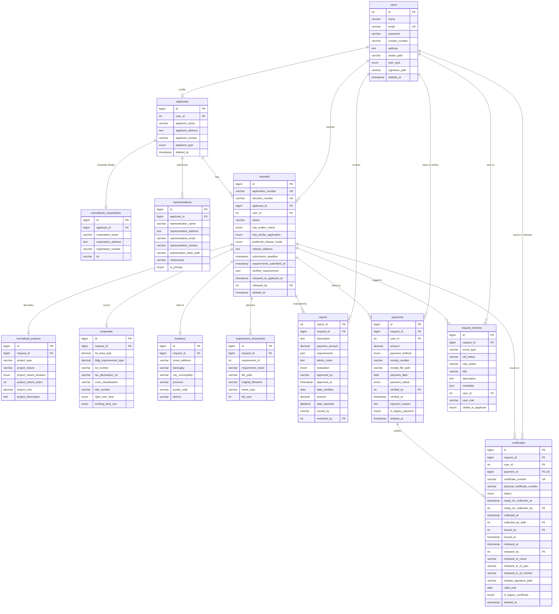
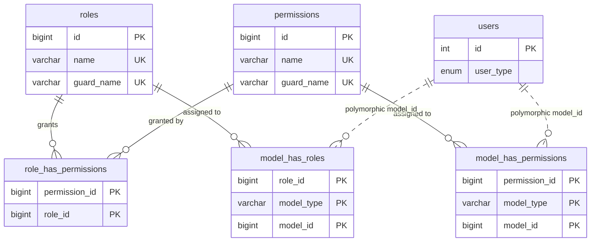
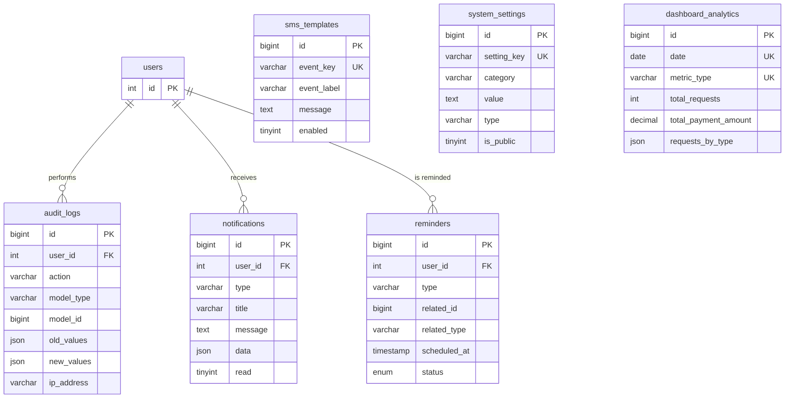

# CPDO Zoning Compliance — Database Schema

> Generated by scanning the live database, not the migration files.
> Source: `zoning_compliance` on MariaDB 10.4.32 (XAMPP, `127.0.0.1:3306`).

| Property | Value |
|---|---|
| Database | `zoning_compliance` |
| Server | MariaDB 10.4.32 |
| Engine | InnoDB (all 32 tables) |
| Charset / Collation | `utf8mb4` / `utf8mb4_unicode_ci` |
| Tables | 32 |
| Foreign keys | 31 |
| Migrations applied | 77 |

---

## 1. Entity-Relationship Diagram

### 1.1 Core application domain



### 1.2 Access control (Spatie Laravel-Permission)



### 1.3 Supporting and infrastructure tables



#### Why some tables have no relationship lines

Not every table joins to another, and in this schema each unconnected table is
unconnected for a different reason. They fall into three groups.

**Group 1 — Configuration and reporting. No foreign key by design.**

| Table | Keyed by | Why it joins to nothing |
|---|---|---|
| `sms_templates` | `event_key` | Message bodies looked up by event name, not by row id. `SmsService::forEvent()` resolves them by string. |
| `system_settings` | `key` | Key/value runtime configuration. Belongs to the installation, not to any record. |
| `dashboard_analytics` | `(date, metric_type)` | Pre-aggregated daily counts. A summary row describes a whole day, not one request. |

These three are correct as they stand — a foreign key would be wrong, not
missing. Note that `system_settings` and `dashboard_analytics` currently have no
Eloquent model and no code that reads or writes them: they exist as migrations
only, so they are unconnected in a second sense as well.

**Group 2 — Laravel framework tables. Outside the application domain.**

`cache`, `cache_locks`, `jobs`, `job_batches`, `failed_jobs`, `sessions`,
`password_reset_tokens`, `migrations`. These are framework plumbing and are
deliberately absent from the ERD. `sessions.user_id` is an index with no
constraint, which is Laravel's own default.

**Group 3 — Polymorphic. The relationship exists but cannot be a foreign key.**

| Table | Columns | Points at |
|---|---|---|
| `reminders` | `related_id`, `related_type` | Any model — resolved by `Reminder::related()` (`morphTo`) |
| `audit_logs` | `model_id`, `model_type` | Any model that was changed |
| `model_has_roles` | `model_id`, `model_type` | Spatie's assignee, normally `users` |
| `model_has_permissions` | `model_id`, `model_type` | Spatie's assignee, normally `users` |

A column whose target table varies per row cannot carry a foreign key in MySQL.
The link is real and enforced in PHP; it simply cannot be drawn as a constrained
edge. This is standard Laravel practice and is defensible as designed.

---

## 2. Table inventory

| # | Table | Rows | Group | Purpose |
|---|---|---:|---|---|
| 1 | `users` | 5 | Identity | All accounts: applicants, staff, admins, super admins |
| 2 | `applicants` | 5 | Identity | Applicant profile, 1:1 with a user account |
| 3 | `normalized_corporations` | 0 | Identity | Corporate details for `applicant_type = 'corporate'` |
| 4 | `representatives` | 0 | Identity | Authorized representatives acting for an applicant |
| 5 | `requests` | 3 | Core | The zoning-clearance application (aggregate root) |
| 6 | `normalized_projects` | 4 | Core | Project type, nature and cost per request |
| 7 | `properties` | 3 | Core | Lot, building and land-use details per request |
| 8 | `locations` | 3 | Core | Street, barangay, city and province per request |
| 9 | `requirement_documents` | 33 | Core | Uploaded requirement files per request |
| 10 | `reports` | 3 | Workflow | Officer evaluation, fee assessment, decision |
| 11 | `payments` | 2 | Workflow | Cash payment records and verification |
| 12 | `certificates` | 2 | Workflow | Certificate issuance, pickup and release |
| 13 | `request_timeline` | 0 | Workflow | Per-request audit timeline shown to applicants |
| 14 | `audit_logs` | 159 | Audit | System-wide model change log |
| 15 | `notifications` | 92 | Comms | In-app notifications |
| 16 | `reminders` | 0 | Comms | Scheduled reminder queue |
| 17 | `sms_templates` | 12 | Comms | Editable SMS bodies keyed by workflow event |
| 18 | `system_settings` | 10 | Config | Key/value runtime configuration |
| 19 | `dashboard_analytics` | 0 | Reporting | Pre-aggregated daily metrics |
| 20 | `roles` | 3 | RBAC | Spatie roles |
| 21 | `permissions` | 7 | RBAC | Spatie permissions |
| 22 | `role_has_permissions` | 7 | RBAC | Role to permission pivot |
| 23 | `model_has_roles` | 7 | RBAC | Model to role pivot |
| 24 | `model_has_permissions` | 0 | RBAC | Model to permission pivot |
| 25 | `sessions` | 4 | Framework | Database session driver |
| 26 | `cache` | 12 | Framework | Database cache store |
| 27 | `cache_locks` | 0 | Framework | Cache lock store |
| 28 | `jobs` | 17 | Framework | Queued jobs |
| 29 | `job_batches` | 0 | Framework | Job batch metadata |
| 30 | `failed_jobs` | 0 | Framework | Failed queue jobs |
| 31 | `password_reset_tokens` | 0 | Framework | Password reset tokens |
| 32 | `migrations` | 77 | Framework | Migration ledger |

Row counts are InnoDB estimates from `information_schema` at scan time.

---

## 3. Foreign key map

| Child table | Column | References | On delete |
|---|---|---|---|
| `applicants` | `user_id` | `users.id` | SET NULL |
| `audit_logs` | `user_id` | `users.id` | SET NULL |
| `certificates` | `request_id` | `requests.id` | CASCADE |
| `certificates` | `user_id` | `users.id` | CASCADE |
| `certificates` | `issued_by` | `users.id` | SET NULL |
| `certificates` | `ready_for_collection_by` | `users.id` | SET NULL |
| `certificates` | `collected_by_staff` | `users.id` | SET NULL |
| `certificates` | `released_by` | `users.id` | SET NULL |
| `certificates` | `payment_id` | `payments.id` | SET NULL |
| `locations` | `request_id` | `requests.id` | CASCADE |
| `model_has_permissions` | `permission_id` | `permissions.id` | CASCADE |
| `model_has_roles` | `role_id` | `roles.id` | CASCADE |
| `normalized_corporations` | `applicant_id` | `applicants.id` | CASCADE |
| `normalized_projects` | `request_id` | `requests.id` | CASCADE |
| `notifications` | `user_id` | `users.id` | CASCADE |
| `payments` | `request_id` | `requests.id` | CASCADE |
| `payments` | `user_id` | `users.id` | SET NULL |
| `payments` | `verified_by` | `users.id` | SET NULL |
| `properties` | `request_id` | `requests.id` | CASCADE |
| `reminders` | `user_id` | `users.id` | CASCADE |
| `reports` | `request_id` | `requests.id` | CASCADE |
| `reports` | `reviewed_by` | `users.id` | SET NULL |
| `representatives` | `applicant_id` | `applicants.id` | CASCADE |
| `requests` | `applicant_id` | `applicants.id` | CASCADE |
| `requests` | `user_id` | `users.id` | SET NULL |
| `requests` | `released_by` | `users.id` | SET NULL |
| `requests` | `requirements_submitted_by` | `users.id` | SET NULL |
| `requests` | `submission_deadline_set_by` | `users.id` | SET NULL |
| `request_timeline` | `request_id` | `requests.id` | CASCADE |
| `request_timeline` | `user_id` | `users.id` | SET NULL |
| `requirement_documents` | `request_id` | `requests.id` | CASCADE |
| `role_has_permissions` | `permission_id` | `permissions.id` | CASCADE |
| `role_has_permissions` | `role_id` | `roles.id` | CASCADE |

All 33 foreign keys use `ON UPDATE RESTRICT`.

Deleting a `requests` row cascades to `certificates`, `locations`,
`normalized_projects`, `payments`, `properties`, `reports`,
`request_timeline` and `requirement_documents`. In practice the main tables
carry `deleted_at`, so the application soft-deletes rather than reaching these
cascades.

`certificates.payment_id` and `reports.reviewed_by` were added by
`2026_09_08_000001_add_missing_foreign_keys_to_certificates_and_reports`. Both
were previously index-only columns that the Eloquent models already treated as
relationships; `reports.reviewed_by` also had to be narrowed from `bigint` to
`int` to match `users.id` before the constraint would hold.

---

## 4. Enumerated values

| Table.column | Values |
|---|---|
| `users.user_type` | `applicant`, `staff`, `admin`, `super_admin` (default `applicant`) |
| `applicants.applicant_type` | `individual`, `corporate` (default `individual`) |
| `requests.status` | `varchar(50)`, default `pending` — not constrained by the database |
| `requests.has_written_notice` | `yes`, `no` |
| `requests.has_similar_application` | `yes`, `no` |
| `requests.preferred_release_mode` | `pickup`, `mail_applicant`, `mail_representative`, `mail_other` |
| `normalized_projects.project_nature_duration` | `Permanent`, `Temporary` |
| `properties.right_over_land` | `Owner`, `Lessee` |
| `properties.existing_land_use` | `Residential`, `Institutional`, `Commercial`, `Industrial`, `Tenanted`, `Vacant`, `Agricultural`, `Not Tenanted` |
| `reports.evaluation` | `pending`, `approved`, `rejected`, `reviewed` |
| `payments.payment_method` | `cash` (single-value enum after gateway removal) |
| `payments.payment_status` | `pending`, `verified`, `rejected` (default `pending`) |
| `certificates.status` | `preparing`, `ready_for_pickup`, `released`, `cancelled` (default `preparing`) |
| `reminders.status` | `pending`, `sent`, `failed` (default `pending`) |

### Request status vocabulary

`requests.status` is a free-text `varchar(50)`. The application's effective
vocabulary, from [app/Models/Request.php](app/Models/Request.php#L53-L58) and
the workflow services, is:

`pending` → `approved` / `rejected` → `payment_confirmed` →
`certificate_preparing` → `certificate_ready` → `released`

The last four are `Request::CERT_LIFECYCLE_STATUSES`. Once a request enters
that range, `requests.status` is the source of truth and `reports.evaluation`
stays frozen at `approved` — `Request::deriveStatus()` implements this split.

Values present in the live data at scan time: `pending`, `certificate_preparing`.

---

## 5. Seeded reference data

### Roles (3)

`admin`, `super_admin`, `applicant` — all on the `web` guard.

### Permissions (7)

`view applications`, `create applications`, `edit applications`,
`delete applications`, `manage reports`, `approve applications`,
`reject applications`.

### SMS template event keys (12)

`application_submitted`, `application_reviewed`, `application_approved`,
`application_approved_next_steps`, `application_rejected`,
`requirements_submitted`, `payment_reminder`, `payment_verified`,
`payment_rejected`, `certificate_preparing`, `certificate_ready`,
`certificate_released`.

### System setting categories (10 settings)

`General` (3), `System` (2), `Uploads` (2), `Certificates` (1),
`Notifications` (1), `Payments` (1).

---

## 6. Data integrity constraints

Beyond primary and foreign keys, `payments` carries three CHECK constraints:

| Constraint | Rule |
|---|---|
| `payments_amount_positive` | `amount > 0` |
| `payments_verified_consistency` | `payment_status = 'verified'` requires both `verified_by` and `verified_at` to be non-null |
| `payments_rejection_reason_required` | `payment_status = 'rejected'` requires `rejection_reason` to be non-null |

JSON columns are stored as `longtext` with a `json_valid()` CHECK (MariaDB's
JSON representation): `audit_logs.old_values`, `audit_logs.new_values`,
`audit_logs.metadata`, `dashboard_analytics.requests_by_type`,
`dashboard_analytics.requests_by_nature`, `dashboard_analytics.metadata`,
`notifications.data`, `reminders.metadata`, `reports.requirements`,
`request_timeline.metadata`, `requests.verified_requirements`.

### Unique constraints

| Table | Unique key |
|---|---|
| `users` | `email` |
| `applicants` | `user_id` (enforces 1:1 with a user) |
| `requests` | `application_number`, `decision_number` |
| `normalized_projects` | `request_id` (enforces 1:1) |
| `properties` | `request_id` (enforces 1:1) |
| `locations` | `request_id` (enforces 1:1) |
| `normalized_corporations` | `applicant_id` (enforces 1:1) |
| `certificates` | `certificate_number`, `payment_id` |
| `sms_templates` | `event_key` |
| `system_settings` | `key` |
| `roles`, `permissions` | `(name, guard_name)` |
| `dashboard_analytics` | `(date, metric_type)` |
| `failed_jobs` | `uuid` |

### Soft deletes

`deleted_at` is present on `users`, `applicants`, `requests`, `payments` and
`certificates`, each with a supporting index. The child detail tables
(`locations`, `properties`, `normalized_projects`, `requirement_documents`,
`request_timeline`) have no `deleted_at` — they are reached only through their
parent request.

---

## 7. Indexing

Notable composite indexes supporting the hot query paths:

| Table | Index | Serves |
|---|---|---|
| `requests` | `(status, created_at)` ×2 | Queue listings ordered by age |
| `requests` | `(user_id, status)` | Applicant's own dashboard |
| `payments` | `(payment_status, payment_date)` ×2 | Payment verification queue |
| `payments` | `(request_id, payment_status)` ×2 | Per-request payment lookup |
| `payments` | `(user_id, payment_date)` | Applicant payment history |
| `certificates` | `(status, issued_at)` | Certificate management board |
| `certificates` | `(request_id, status)` | Per-request certificate lookup |
| `notifications` | `(user_id, read, created_at)` | Unread badge and feed |
| `notifications` | `(user_id, read)` | Unread count |
| `audit_logs` | `(user_id, created_at)` | Per-user audit trail |
| `audit_logs` | `(model_type, model_id)` | Per-record audit trail |
| `request_timeline` | `(request_id, created_at)` | Timeline render |
| `request_timeline` | `(request_id, event_type)` | Filtered timeline |
| `reminders` | `(status, scheduled_at)` | Due-reminder sweep |
| `reminders` | `(related_type, related_id)` | Polymorphic target lookup |
| `requirement_documents` | `(request_id, requirement_id)` | Requirement checklist |

Several pairs are duplicates left by successive index migrations.
`payments_payment_status_payment_date_index` and
`payments_status_date_composite` cover the same columns, as do the two
`requests (status, created_at)` indexes and the two
`payments (request_id, payment_status)` indexes. They cost write throughput and
buffer-pool space without adding read coverage.

---

## 8. Observations

Findings from the scan, in rough order of how much they matter.

1. **`reminders.scheduled_at` is `ON UPDATE current_timestamp()`.** Any update
   to a reminder row — including flipping `status` to `sent` — rewrites the
   scheduled time to now. The original scheduled time is not recoverable after
   the first update.

2. ~~**`reports.reviewed_by` has an index but no foreign key.**~~ **Resolved
   2026-09-08.** The column was `bigint(20) unsigned` against an
   `int(10) unsigned` `users.id`; the width mismatch was what blocked the
   constraint. It is now `int(10) unsigned` with
   `reports_reviewed_by_foreign … ON DELETE SET NULL`.

3. ~~**`certificates.payment_id` has a UNIQUE key but no foreign key.**~~
   **Resolved 2026-09-08.** The one-certificate-per-payment rule was enforced
   by the UNIQUE key, but nothing stopped a `payment_id` from pointing at a row
   that did not exist. It now carries
   `certificates_payment_id_foreign … ON DELETE SET NULL`.

4. **`requests.status` is unconstrained `varchar(50)`.** The workflow
   vocabulary in section 4 lives only in PHP. A typo in a status string writes
   successfully and silently strands the request outside every status filter.

5. **`reports` has two fee columns**: `payment_amount decimal(10,2)` and
   `amount decimal(12,2)`, plus `approved_by` and `issued_by` as free-text
   `varchar(255)` rather than user references — legacy shape from before the
   normalization migrations.

6. **`reports` uses `report_id` as its primary key**, the only table in the
   schema not using `id`.

7. **`users.id` is `int(10) unsigned`** while every other primary key is
   `bigint(20) unsigned`, a legacy of the original Laravel `users` table. Every
   foreign key column pointing at it now matches. Any new column referencing
   `users.id` must be declared `unsignedInteger`, not `unsignedBigInteger`, or
   MySQL will reject the constraint.

8. **`payments.payment_method` is a single-value enum** (`cash`) after
   `2026_05_08_remove_payment_gateway_features`. It is a column that can only
   hold one value.

9. **`dashboard_analytics`, `request_timeline`, `reminders`,
   `representatives`, `normalized_corporations` and `model_has_permissions`
   are all empty**, so the features behind them are unexercised against real
   data.

---

## 9. Regenerating this document

```bash
# Start MariaDB if it is not running
C:/xampp/mysql/bin/mysqld.exe --defaults-file=C:/xampp/mysql/bin/my.ini --standalone

# Full DDL
C:/xampp/mysql/bin/mysqldump.exe -u root --no-data --skip-comments zoning_compliance

# Foreign key map
C:/xampp/mysql/bin/mysql.exe -u root -e "
SELECT kcu.TABLE_NAME, kcu.COLUMN_NAME, kcu.REFERENCED_TABLE_NAME, rc.DELETE_RULE
FROM information_schema.KEY_COLUMN_USAGE kcu
JOIN information_schema.REFERENTIAL_CONSTRAINTS rc
  ON rc.CONSTRAINT_NAME = kcu.CONSTRAINT_NAME
 AND rc.CONSTRAINT_SCHEMA = kcu.TABLE_SCHEMA
WHERE kcu.TABLE_SCHEMA='zoning_compliance'
  AND kcu.REFERENCED_TABLE_NAME IS NOT NULL
ORDER BY kcu.TABLE_NAME;"
```
