# CPDO LC System - Use Case Diagram

## System Overview
**System Name:** CPDO Locational Clearance System (CPDO LC)  
**Purpose:** Manage locational clearance applications for City of Ilagan, Isabela  
**Actors:** Applicant, Admin (Zoning Officer), Super Admin (Zoning Administrator)

---

## Actors

### 1. **Applicant** (Primary User)
- Citizens or businesses applying for locational clearances
- Can submit applications online
- Track application status
- Upload documents and payment receipts

### 2. **Admin** (Zoning Officer)
- Review applications
- Verify documents
- Generate certificates
- Record payments
- Send notifications

### 3. **Super Admin** (Zoning Administrator)
- All Admin capabilities
- Final approval authority
- User management
- System configuration
- Audit log access
- SMS broadcast

### 4. **System** (Supporting Actor)
- Automated email notifications
- Automated SMS notifications
- Scheduled reminders
- Audit logging

---

## Use Case Diagram (PlantUML)

```plantuml
@startuml CPDO_LC_Use_Case_Diagram

left to right direction
skinparam packageStyle rectangle

actor "Applicant" as applicant #lightblue
actor "Admin\n(Zoning Officer)" as admin #lightgreen
actor "Super Admin\n(Zoning Administrator)" as superadmin #orange
actor "System" as system #gray

rectangle "CPDO LC System" {
  
  ' ===== APPLICANT USE CASES =====
  package "Application Management" #lightblue {
    usecase "Register Account" as UC1
    usecase "Login/Logout" as UC2
    usecase "Submit New Application" as UC3
    usecase "Fill Application Form\n(4 Steps)" as UC3.1
    usecase "Upload Required Documents" as UC3.2
    usecase "View My Applications" as UC4
    usecase "Edit Application\n(if Pending)" as UC5
    usecase "Track Application Status" as UC6
    usecase "Download Application Form" as UC7
  }
  
  package "Payment Management" #lightyellow {
    usecase "View Order of Payment" as UC8
    usecase "Upload Payment Receipt" as UC9
    usecase "View Payment Status" as UC10
  }
  
  package "Certificate Management" #lightcyan {
    usecase "Download Certificate" as UC11
    usecase "Download Clearance" as UC12
    usecase "Print Certificate" as UC13
    usecase "View Certificate Status" as UC14
  }
  
  package "Profile Management" #lavender {
    usecase "Update Profile" as UC15
    usecase "Change Password" as UC16
    usecase "Upload Avatar" as UC17
  }
  
  package "Notifications" #mistyrose {
    usecase "Receive Email Notifications" as UC18
    usecase "Receive SMS Notifications" as UC19
    usecase "View Notification History" as UC20
  }
  
  ' ===== ADMIN USE CASES =====
  package "Application Review (Admin)" #lightgreen {
    usecase "View All Applications" as UC21
    usecase "Filter/Search Applications" as UC22
    usecase "Review Application Details" as UC23
    usecase "Verify Documents" as UC24
    usecase "Mark Requirements Complete" as UC25
    usecase "Evaluate Application" as UC26
    usecase "Set Payment Amount" as UC27
    usecase "Submit for Approval" as UC28
    usecase "Print Application Form" as UC29
  }
  
  package "Certificate Generation (Admin)" #lightcoral {
    usecase "Generate Certificate" as UC30
    usecase "Generate Clearance\n(CZ/CZC/TUP/SUP)" as UC31
    usecase "Fill Certificate Details" as UC32
    usecase "Preview Certificate" as UC33
    usecase "Mark Certificate Ready" as UC34
    usecase "Record Certificate Release" as UC35
  }
  
  package "Payment Processing (Admin)" #lightsalmon {
    usecase "View Payments" as UC36
    usecase "Record Payment" as UC37
    usecase "Verify Payment Receipt" as UC38
    usecase "View Payment Details" as UC39
  }
  
  package "Reports & Export (Admin)" #lightsteelblue {
    usecase "View Dashboard Statistics" as UC40
    usecase "Export Applications (Excel)" as UC41
    usecase "Export Payments (Excel)" as UC42
    usecase "Generate Reports" as UC43
  }
  
  ' ===== SUPER ADMIN USE CASES =====
  package "Final Approval (Super Admin)" #orange {
    usecase "Review Submitted Applications" as UC44
    usecase "Approve Application" as UC45
    usecase "Reject Application" as UC46
    usecase "Return to Zoning Officer" as UC47
    usecase "One-Step Review & Decide" as UC48
  }
  
  package "User Management (Super Admin)" #gold {
    usecase "View All Users" as UC49
    usecase "Create Admin Account" as UC50
    usecase "Edit User Account" as UC51
    usecase "Deactivate User" as UC52
    usecase "Reset User Password" as UC53
  }
  
  package "SMS Management (Super Admin)" #khaki {
    usecase "Send SMS Broadcast" as UC54
    usecase "Manage SMS Templates" as UC55
    usecase "View SMS History" as UC56
  }
  
  package "System Administration (Super Admin)" #wheat {
    usecase "View Audit Logs" as UC57
    usecase "Export Audit Logs" as UC58
    usecase "Configure System Settings" as UC59
    usecase "Manage Signatures" as UC60
  }
  
  ' ===== SYSTEM USE CASES =====
  package "Automated Processes" #lightgray {
    usecase "Send Auto Email Notifications" as UC61
    usecase "Send Auto SMS Notifications" as UC62
    usecase "Send Payment Reminders" as UC63
    usecase "Log System Activities" as UC64
    usecase "Generate Application Numbers" as UC65
    usecase "Cache Dashboard Analytics" as UC66
  }
}

' ===== APPLICANT RELATIONSHIPS =====
applicant --> UC1
applicant --> UC2
applicant --> UC3
UC3 ..> UC3.1 : <<include>>
UC3 ..> UC3.2 : <<include>>
applicant --> UC4
applicant --> UC5
applicant --> UC6
applicant --> UC7
applicant --> UC8
applicant --> UC9
applicant --> UC10
applicant --> UC11
applicant --> UC12
applicant --> UC13
applicant --> UC14
applicant --> UC15
applicant --> UC16
applicant --> UC17
applicant --> UC18
applicant --> UC19
applicant --> UC20

' ===== ADMIN RELATIONSHIPS =====
admin --> UC2
admin --> UC21
admin --> UC22
admin --> UC23
admin --> UC24
admin --> UC25
admin --> UC26
admin --> UC27
admin --> UC28
admin --> UC29
admin --> UC30
admin --> UC31
UC31 ..> UC32 : <<include>>
admin --> UC33
admin --> UC34
admin --> UC35
admin --> UC36
admin --> UC37
admin --> UC38
admin --> UC39
admin --> UC40
admin --> UC41
admin --> UC42
admin --> UC43
admin --> UC15
admin --> UC16

' ===== SUPER ADMIN RELATIONSHIPS =====
superadmin --|> admin : <<extends>>
superadmin --> UC44
superadmin --> UC45
superadmin --> UC46
superadmin --> UC47
superadmin --> UC48
superadmin --> UC49
superadmin --> UC50
superadmin --> UC51
superadmin --> UC52
superadmin --> UC53
superadmin --> UC54
superadmin --> UC55
superadmin --> UC56
superadmin --> UC57
superadmin --> UC58
superadmin --> UC59
superadmin --> UC60

' ===== SYSTEM RELATIONSHIPS =====
system --> UC61
system --> UC62
system --> UC63
system --> UC64
system --> UC65
system --> UC66

' ===== INCLUDES/EXTENDS RELATIONSHIPS =====
UC3 ..> UC65 : <<include>>
UC26 ..> UC64 : <<include>>
UC28 ..> UC61 : <<trigger>>
UC28 ..> UC62 : <<trigger>>
UC45 ..> UC61 : <<trigger>>
UC45 ..> UC62 : <<trigger>>
UC46 ..> UC61 : <<trigger>>
UC37 ..> UC61 : <<trigger>>
UC38 ..> UC61 : <<trigger>>
UC34 ..> UC61 : <<trigger>>
UC35 ..> UC61 : <<trigger>>

@enduml
```



---

## Use Case Descriptions

### Applicant Use Cases

| UC# | Use Case | Description |
|-----|----------|-------------|
| UC1 | Register Account | Applicant creates account (typically done by admin) |
| UC2 | Login/Logout | Authenticate to access system |
| UC3 | Submit New Application | Complete 4-step application form for locational clearance |
| UC3.1 | Fill Application Form | Enter applicant info, project details, land use, requirements |
| UC3.2 | Upload Required Documents | Upload supporting documents during application |
| UC4 | View My Applications | See list of all submitted applications |
| UC5 | Edit Application | Modify pending application before admin review |
| UC6 | Track Application Status | Monitor progress (Pending → Under Review → Approved → etc.) |
| UC7 | Download Application Form | Download filled application form PDF |
| UC8 | View Order of Payment | View payment order with amount and details |
| UC9 | Upload Payment Receipt | Submit OR (Official Receipt) after payment |
| UC10 | View Payment Status | Check if payment verified or rejected |
| UC11 | Download Certificate | Download issued certificate (CZ/CZC/TUP/SUP) |
| UC12 | Download Clearance | Download locational clearance document |
| UC13 | Print Certificate | Print certificate for physical copy |
| UC14 | View Certificate Status | Check certificate preparation status |
| UC15 | Update Profile | Edit personal information |
| UC16 | Change Password | Update account password |
| UC17 | Upload Avatar | Add profile picture |
| UC18 | Receive Email Notifications | Get email updates on application status |
| UC19 | Receive SMS Notifications | Get SMS updates on application status |
| UC20 | View Notification History | See all past notifications |

### Admin (Zoning Officer) Use Cases

| UC# | Use Case | Description |
|-----|----------|-------------|
| UC21 | View All Applications | Access complete list of applications |
| UC22 | Filter/Search Applications | Search by status, type, date, applicant name |
| UC23 | Review Application Details | View complete application information |
| UC24 | Verify Documents | Check uploaded requirement documents |
| UC25 | Mark Requirements Complete | Confirm all documents submitted |
| UC26 | Evaluate Application | Review and assess application |
| UC27 | Set Payment Amount | Determine fee based on project type |
| UC28 | Submit for Approval | Forward reviewed application to Zoning Administrator |
| UC29 | Print Application Form | Generate printable application form |
| UC30 | Generate Certificate | Create certificate document (CZ/CZC/TUP/SUP) |
| UC31 | Generate Clearance | Create locational clearance document |
| UC32 | Fill Certificate Details | Enter lot number, tax declaration, zoning details |
| UC33 | Preview Certificate | View certificate before finalizing |
| UC34 | Mark Certificate Ready | Indicate certificate ready for pickup |
| UC35 | Record Certificate Release | Log certificate handover to applicant |
| UC36 | View Payments | See all payment records |
| UC37 | Record Payment | Manually enter payment details |
| UC38 | Verify Payment Receipt | Approve uploaded payment receipts |
| UC39 | View Payment Details | See payment information and history |
| UC40 | View Dashboard Statistics | Monitor key metrics and counts |
| UC41 | Export Applications | Download application data to Excel |
| UC42 | Export Payments | Download payment data to Excel |
| UC43 | Generate Reports | Create various reports |

### Super Admin (Zoning Administrator) Use Cases

| UC# | Use Case | Description |
|-----|----------|-------------|
| UC44 | Review Submitted Applications | View applications marked "For Approval" |
| UC45 | Approve Application | Grant final approval for application |
| UC46 | Reject Application | Deny application with reason |
| UC47 | Return to Zoning Officer | Send back for additional review |
| UC48 | One-Step Review & Decide | Review and approve/reject in one action |
| UC49 | View All Users | See all system users (applicants, admins) |
| UC50 | Create Admin Account | Add new zoning officer account |
| UC51 | Edit User Account | Modify user information |
| UC52 | Deactivate User | Soft delete user account |
| UC53 | Reset User Password | Change password for any user |
| UC54 | Send SMS Broadcast | Send bulk SMS to applicants |
| UC55 | Manage SMS Templates | Edit auto-notification SMS messages |
| UC56 | View SMS History | See SMS delivery logs |
| UC57 | View Audit Logs | Monitor all system activities |
| UC58 | Export Audit Logs | Download audit trail to Excel |
| UC59 | Configure System Settings | Adjust system parameters |
| UC60 | Manage Signatures | Upload/update e-signatures |

### System Automated Use Cases

| UC# | Use Case | Description |
|-----|----------|-------------|
| UC61 | Send Auto Email Notifications | Trigger emails on status changes |
| UC62 | Send Auto SMS Notifications | Trigger SMS on status changes |
| UC63 | Send Payment Reminders | Scheduled reminders for pending payments |
| UC64 | Log System Activities | Record all actions in audit log |
| UC65 | Generate Application Numbers | Auto-assign unique application IDs |
| UC66 | Cache Dashboard Analytics | Pre-compute dashboard metrics |

---

## Application Workflow

```
┌─────────────┐
│  Applicant  │
│   Submits   │
└──────┬──────┘
       │
       ▼
┌─────────────┐
│   Pending   │ ◄─── Auto-generates application number
└──────┬──────┘      Sends email/SMS notification
       │
       ▼
┌─────────────┐
│    Admin    │
│   Reviews   │ ◄─── Verifies documents
└──────┬──────┘      Sets payment amount
       │
       ├─── Incomplete ──► Return to Applicant
       │
       ▼
┌─────────────┐
│ For Approval│ ◄─── Submitted to Super Admin
└──────┬──────┘      Email/SMS sent
       │
       ▼
┌─────────────┐
│ Super Admin │
│   Reviews   │
└──────┬──────┘
       │
       ├─── Reject ──────► Denied (with reason)
       │
       ├─── Return ──────► Back to Admin for re-review
       │
       ▼
┌─────────────┐
│  Approved   │ ◄─── Email/SMS notification
└──────┬──────┘      Order of Payment generated
       │
       ▼
┌─────────────┐
│  Applicant  │
│  Pays Fee   │ ◄─── At City Treasury Office
└──────┬──────┘      Uploads OR
       │
       ▼
┌─────────────┐
│    Admin    │
│  Verifies   │ ◄─── Checks payment receipt
│   Payment   │
└──────┬──────┘
       │
       ├─── Invalid ──► Payment Rejected
       │
       ▼
┌─────────────┐
│  Payment    │
│  Verified   │ ◄─── Status: For Certificate Preparation
└──────┬──────┘
       │
       ▼
┌─────────────┐
│    Admin    │
│  Generates  │ ◄─── Creates Certificate/Clearance
│ Certificate │      Enters additional details
└──────┬──────┘
       │
       ▼
┌─────────────┐
│ Certificate │
│   Ready     │ ◄─── Email/SMS notification
└──────┬──────┘      Ready for pickup
       │
       ▼
┌─────────────┐
│    Admin    │
│  Records    │ ◄─── Logs release to applicant
│  Release    │      With ID verification
└──────┬──────┘
       │
       ▼
┌─────────────┐
│  Released   │ ◄─── Applicant receives certificate
│  Complete   │      Can download/print
└─────────────┘
```

---

## Certificate Types

The system supports 4 types of locational clearances:

1. **CZ** - Zoning Certification
2. **CZC** - Zoning Clearance  
3. **TUP** - Temporary Use Permit
4. **SUP** - Special Use Permit

Each type has specific format and conditions.

---

## Key Features

### Authentication & Authorization
- Role-based access control (Applicant, Admin, Super Admin)
- Session management (15-minute timeout)
- Email verification required
- Secure password handling

### Document Management
- Multi-file upload support
- PDF, JPG, JPEG, PNG formats
- 10MB file size limit
- Secure storage with links

### Notification System
- Email notifications (SMTP)
- SMS notifications (Semaphore API)
- Auto-notifications on status changes
- Manual SMS broadcasts

### Audit & Compliance
- Complete audit trail
- All actions logged with user/timestamp
- Exportable audit logs
- Document versioning

### Performance
- Dashboard analytics caching
- Database query optimization
- Composite indexes
- Soft deletes for data recovery

---

## System Integrations

1. **Email Service** - Hostinger SMTP
2. **SMS Service** - Semaphore API
3. **Payment** - Manual OR verification (no payment gateway)
4. **Storage** - Local file system with symlinks

---

## Technology Stack

- **Backend:** Laravel 10 (PHP)
- **Frontend:** React + Inertia.js
- **Database:** MySQL
- **Styling:** Tailwind CSS
- **PDF Generation:** html2pdf.js
- **Deployment:** Hostinger

---

**Generated:** September 3, 2026  
**System Version:** 1.0 Production  
**For:** City Planning and Development Office, City of Ilagan, Isabela
